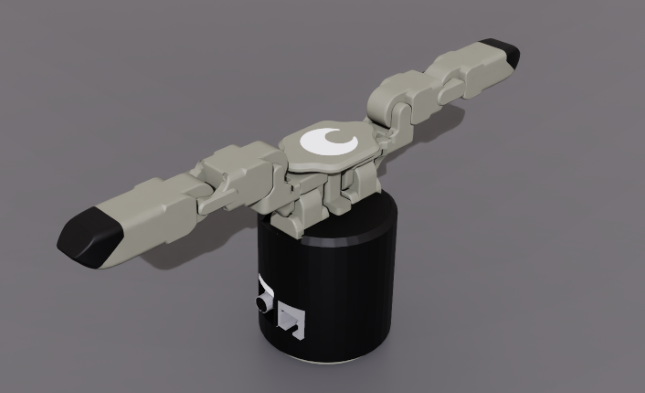
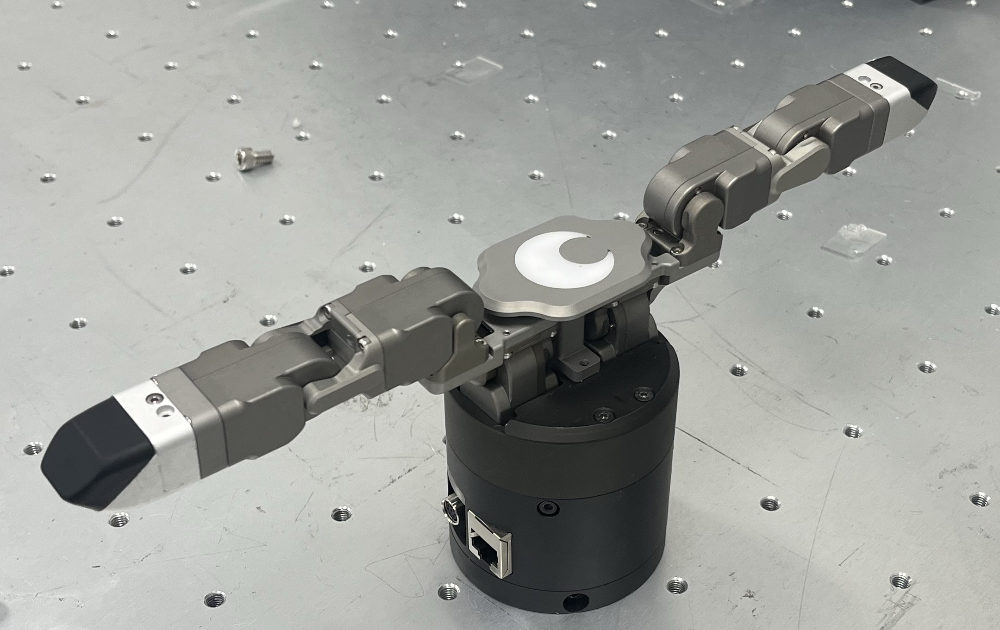

## 👋 DG2F-M

| Sim | Real |
| :---: | :---: |
|  |  |
| *DG2FM (Sim)* | *DG2FM (Real)* |

This directory contains the 3D models and simulation configuration files for the **DG2F-M**.
### 📁 Directory Structure & Supported Formats

#### 1. Meshes (`.stl`, `.dae`)
3D mesh files for visual rendering and collision detection.
* `meshes/*.stl, *.dae`

#### 2. URDF (`.urdf`)
Standard robot model files for ROS and general-purpose robotics simulators.
* `dg2fm_force_v2.urdf`

#### 3. USD (`.usd`)
Ready-to-use USD files specifically configured for NVIDIA Isaac Sim and Isaac Lab environments.
* `usd/dg2fm_force_v2/dg2fm.usd`
